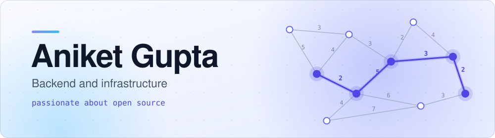
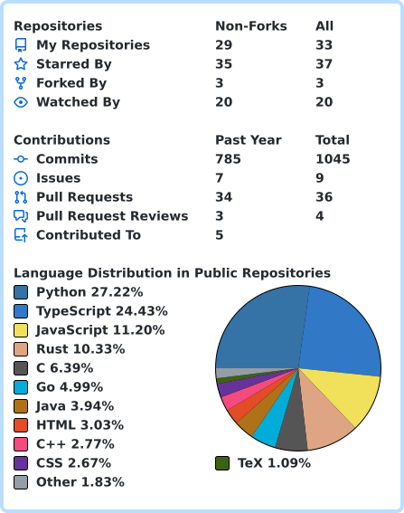

<picture>
  <source media="(prefers-color-scheme: dark)" srcset="assets/banner-dark.svg">
  
</picture>

I work on backend and infra, mostly Python, Go, Rust and TypeScript. I'm a beginner, but I'm passionate about contributing to open source. I also like algorithms and hackathons.

  

### Hackathons

I love [Hackathon Raptors](https://www.raptors.dev/) hackathons. Won two of them: [zql](https://github.com/aniket-3001/zql) at [Zero Dependency](https://zerodepshack.com/) and [cron-parser-go](https://github.com/aniket-3001/cron-parser-go) at [Port Mortem](https://coderesurrection.com/2026/). I also contributed to [HackPulse](https://github.com/Abhishekjha18/hackpulse), a self-hosted hackathon portal built for [Dogfood](https://dogfoodhack.com/#judges).

### Algorithms

I love solving algorithms. Working through [Jeff Erickson's *Algorithms*](https://jeffe.cs.illinois.edu/teaching/algorithms/) book, my C++ solutions are in [jeff-erickson-algorithms](https://github.com/aniket-3001/jeff-erickson-algorithms).

### Activity

<picture>
  <source media="(prefers-color-scheme: dark)" srcset="assets/stats-dark.svg">
  
</picture>

### Stack

**Languages** &nbsp;

**Infra** &nbsp;

